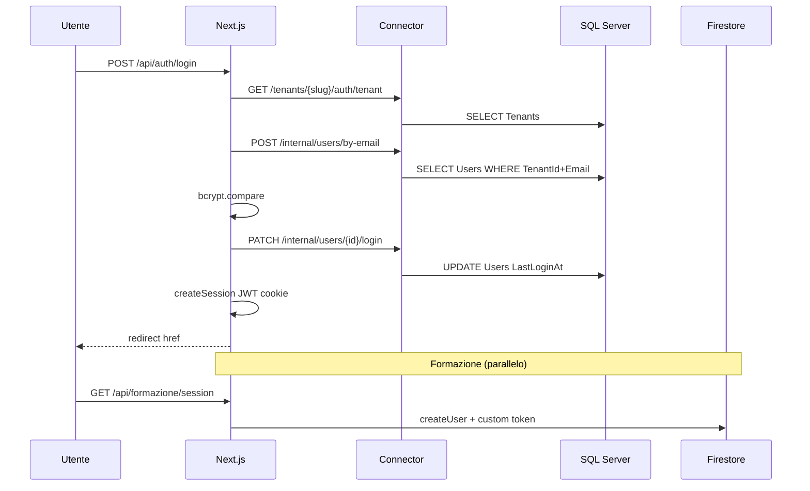

# FASE L — Audit e consolidamento finale

**Data:** 2026-08-30  
**Scope:** autenticazione, registrazione, gestione utenti, percorso `DATABASE_PROVIDER=connector`, residui Prisma, Firestore permanente  
**Vincoli rispettati:** nessuna eliminazione di `firebasePrisma.ts`, repository Prisma fallback o codice Firebase; nessuna migrazione distruttiva; nessuna modifica architetturale in questa fase

**Riferimenti collaudo precedente:** [`PHASE_COLLAUDO_REPORT.md`](PHASE_COLLAUDO_REPORT.md) — connector 39/39 PASS, Firestore login seed non allineato

---

## Executive summary

| Area | Stato connector | Criticità |
|------|-----------------|-----------|
| Login SQL via Connector | ✅ Funzionante | — |
| Logout / sessione | ✅ Funzionante | Bassa (no revoca server-side) |
| Primo admin / nuovo tenant | ⚠️ Solo seed/manuale | **Alta** (gap operativo) |
| CRUD operatori | ✅ Funzionante | Media (policy password, no riattivazione) |
| Registrazione utenti | ⚠️ Solo admin-provisioned | — (by design) |
| Password (change/reset/history) | ✅ Funzionante | Media (policy incoerente in creazione) |
| Ruoli / autorizzazioni | ✅ Solide | — |
| Account disabilitati | ✅ Parziale | Media (no lockout brute-force) |
| Cookie / JWT | ✅ Adeguato dev | **Alta** in prod se env mancanti |
| Brute-force protection | ❌ Assente | **Alta** |
| Tenant isolation auth | ✅ Login/session OK | **Alta** su internal Connector writes |
| Percorso SQL unico | ✅ Confermato | Bassa (1 edge-case Prisma) |
| Firestore fallback | ⚠️ Lettura OK, login seed | Media (ambiente) |

**Conclusione:** la migrazione operativa SQL è **sostanzialmente completa** per auth/utenti. Prima del cleanup finale servono correzioni di **sicurezza Connector** e **policy password**, più una **strategia di provisioning tenant** per il cliente finale.

---

## 1. Login SQL tramite Connector

### Flusso attuale

```text
Browser POST /api/auth/login { tenantSlug, email, password }
  → authenticateLogin() [loginCore.ts]
      → normalizeTenantSlug(slug)
      → findTenantBySlug(slug)          → Connector GET /tenants/:slug/auth/tenant
      → findUserByEmail(tenantId, email) → Connector POST /internal/users/by-email
      → bcrypt.compare(password, hash)
      → updateUserLogin()                → Connector PATCH /internal/users/:id/login
      → writeAudit("login")
      → calcolo redirect (password scaduta / formazione / setup-sedi / postazione / home)
  → createSession(session)               → cookie JWT gestionale_session (12h)
```

### File chiave

| File | Ruolo |
|------|-------|
| `src/lib/loginCore.ts` | Validazione credenziali, redirect post-login |
| `src/lib/data/operationalAccess.ts` | Bridge Firestore \| Connector per auth |
| `src/lib/data/connector/ConnectorRepository.ts` | HTTP verso `/internal/*` e tenant auth |
| `connector/src/routes/auth.ts` | Route auth pubbliche + interne |
| `connector/src/services/usersService.ts` | Query SQL `Tenants`, `Users`, `PasswordHistory` |
| `src/app/api/auth/login/route.ts` | Endpoint HTTP usato da `LoginForm.tsx` |
| `src/actions/login.ts` | Server action equivalente (**non usata dalla UI**) |

### Esito audit

| Controllo | Esito |
|-----------|-------|
| Login ADMIN/OPERATOR su SQL | ✅ Collaudo PASS |
| Tenant slug obbligatorio | ✅ |
| Utente disattivo → errore generico | ✅ |
| Tenant inattivo → errore esplicito | ✅ |
| Post-login sedi setup (fix tenantSlug) | ✅ Corretto in collaudo |

### Problemi

| ID | Severità | Descrizione |
|----|----------|-------------|
| L-01 | Bassa | `loginAction` duplicata rispetto a `/api/auth/login` — codice morto lato UI |
| L-02 | Bassa | Log debug su fallimento login (`hashLen`, `passwordLen`) in `loginCore.ts:66-70` |
| L-03 | **Alta** | Nessun rate limiting / lockout su tentativi falliti (vedi §11) |

---

## 2. Logout e gestione sessione

### Flusso attuale

```text
logoutAction() [core.ts]
  → releaseAllUserLocks(user.id)
  → clearSession()                     → delete cookie gestionale_session
  → usersDbFromUser().update({ lastLogoutAt })
  → writeAudit("logout")
  → redirect("/login")
```

### Session reload (ogni richiesta)

```text
getCurrentUser() [auth.ts, cache React]
  → jwtVerify(gestionale_session)
  → loadSessionUser(id, tenantId)      → Connector GET /internal/users/:id/session?tenantId=
  → reject se user.active=false o tenant.active=false
```

### Cookie / JWT

| Proprietà | Valore |
|-----------|--------|
| Nome | `gestionale_session` |
| Algoritmo | HS256 (`jose`) |
| TTL | 12 ore (JWT + `maxAge`) |
| Flags | `httpOnly`, `sameSite: lax`, `secure` solo in `NODE_ENV=production` |
| Payload JWT | `id`, `email`, `name`, `role`, `supervisorId`, `tenantId`, `formazioneOnly` |
| **Non in JWT** | `tenantSlug`, `postazioneId` — ricaricati da DB |

### Esito audit

| Controllo | Esito |
|-----------|-------|
| Logout libera lock | ✅ |
| `lastLogoutAt` persistito su SQL | ✅ (colonna `Users.LastLogoutAt`) |
| Session invalidata se utente disattivato | ✅ (reload DB) |
| Password scaduta blocca app (redirect/403 API) | ✅ `guard.ts` + layout |
| Logout testato in collaudo | ⚠️ **Non esplicitamente** — solo login |

### Problemi

| ID | Severità | Descrizione |
|----|----------|-------------|
| L-04 | Media | Nessuna revocation list server-side: JWT valido fino a scadenza anche dopo logout/disabilitazione fino al prossimo `getCurrentUser()` |
| L-05 | Bassa | Nessun idle timeout oltre al TTL fisso 12h |
| L-06 | Media | `SESSION_SECRET` fallback dev se env assente (vedi §10) |

---

## 3. Creazione del primo amministratore

### Stato attuale

**Non esiste flusso runtime** per creare tenant o primo admin. Provisioning solo esterno:

| Meccanismo | File | Cosa crea |
|------------|------|-----------|
| Seed SQL dev | `database/seed/seed-sql-dev.mjs` | Tenants `demo`/`alfa`, admin `admin@gestionale.local` / `Demo123!` |
| Seed Firestore | `scripts/seed-firebase.ts` | Tenant demo + admin (hash può divergere da SQL) |
| Schema | `database/migrations/001_initial_schema.sql` | Tabelle `Tenants`, `Users`, `PasswordHistory` |

### Esito audit

| Controllo | Esito |
|-----------|-------|
| Primo admin in SQL | ✅ Via seed |
| Wizard in-app per nuova azienda | ❌ Assente |
| API Connector per creare tenant | ❌ Assente |

### Problemi

| ID | Severità | Descrizione |
|----|----------|-------------|
| L-07 | **Critica operativa** | Nuovo cliente richiede INSERT manuale su `Tenants` + `Users` o script dedicato — non self-service |
| L-08 | Media | Seed Firestore e SQL non garantiti allineati (password admin collaudo Firestore FAIL) |

---

## 4. Creazione / modifica / disattivazione operatori

### Flusso creazione

```text
/operatori → NuovoOperatoreForm
  → createOperatoreAction [operatoriAdmin.ts]
      → requireWritablePermission("operatori:manage")
      → validazione ruolo (ruoliCreabiliDa)
      → sedeId obbligatoria
      → usersDbFromUser().create()
          → Connector POST /tenants/:slug/users/
          → usersAdminService.createUser → INSERT dbo.Users
```

### Modifiche supportate

| Action | Campi |
|--------|-------|
| `updateAcronimoAction` | acronimo |
| `updateRuoloAction` | role (ADMIN solo da ADMIN) |
| `updateSedeUtenteAction` | sedeId |
| `updateFormazioneOnlyAction` | formazioneOnly |
| `deleteOperatoreAction` | **soft delete** `active: false` |

### Esito audit

| Controllo | Esito |
|-----------|-------|
| Creazione via Connector SQL | ✅ Collaudo PASS |
| Isolamento tenant su CRUD | ✅ `tenantId` in ogni query admin |
| Permesso `operatori:manage` | ✅ ADMIN + AMMINISTRAZIONE |
| Disattivazione | ✅ Soft delete |
| Riattivazione | ❌ Nessuna action/UI per `active: true` |
| Hard delete | ❌ Non implementato (corretto per audit) |

### Problemi

| ID | Severità | Descrizione |
|----|----------|-------------|
| L-09 | Media | `createOperatoreAction` accetta password con solo `length >= 6` — **non** chiama `validatePasswordComplexity` (password deboli possibili alla creazione) |
| L-10 | Bassa | `revalidatePath("/utenti")` ma pagina `/utenti` non esiste |
| L-11 | Bassa | `createUserAction` in `core.ts` duplicata e **senza chiamanti** |

---

## 5. Registrazione di nuovi utenti

### Stato

**Non esiste self-registration.** Tutti gli utenti sono creati da ADMIN/AMMINISTRAZIONE.

| Entry point | Esiste |
|-------------|--------|
| Signup pubblico | ❌ |
| Invito email | ❌ |
| Admin `/operatori` | ✅ |
| Connector `POST /tenants/:slug/users/` | ✅ (solo server-to-server) |

**Valutazione:** coerente con modello B2B enterprise; non è un bug ma va documentato per il cliente.

---

## 6. Password iniziale, cambio password e reset password

### Flussi

| Flusso | Entry | Validazione | Persistenza connector |
|--------|-------|-------------|----------------------|
| **Password iniziale** (creazione operatore) | `createOperatoreAction` | Solo len ≥ 6 | INSERT diretto hash |
| **Cambio self-service** | `changePasswordAction` | Complexity + reuse + current pwd | `rotateUserPassword` |
| **Reset admin** | `resetPasswordAmministrazioneAction` | len ≥ 6 → `rotateUserPassword` enforce complexity | Connector internal |
| **Reset supervisor** | `resetPasswordAction` | len ≥ 6 → `rotateUserPassword` | Connector internal |
| **Password scaduta** | redirect `/cambia-password` | `allowExpiredPassword: true` | — |
| **Forgot password / email** | — | ❌ Non implementato | — |

### `rotateUserPassword` [passwordPolicy.ts]

1. `validatePasswordComplexity` (min 6, maiuscola, speciale)
2. `assertPasswordNotReused` (hash corrente + history)
3. Archivia hash vecchio → aggiorna hash + `passwordChangedAt`
4. Connector: `POST /internal/users/:id/password-history` + `PATCH /internal/users/:id/password`

### Esito audit

| Controllo | Esito |
|-----------|-------|
| Cambio password con history | ✅ |
| Scadenza 30 giorni | ✅ |
| Reset admin/supervisor | ✅ (complexity enforced in rotate) |
| Password iniziale debole | ⚠️ **Possibile** (bypass complexity) |

### Problemi

| ID | Severità | Descrizione |
|----|----------|-------------|
| L-09 | Media | Policy incoerente creazione vs change/reset (vedi §4) |
| L-12 | Media | Nessun flusso recupero password dimenticata |
| L-13 | Bassa | Reset admin/supervisor: messaggio errore complexity solo dopo submit (perché check in `rotateUserPassword`, non nel form) |

---

## 7. PasswordHistory e policy password

### Regole [`passwordRules.ts`]

- Minimo 6 caratteri
- Almeno 1 maiuscola
- Almeno 1 carattere speciale
- Max age: **30 giorni** (`PASSWORD_MAX_AGE_DAYS`)

### Storage

| Provider | Tabella/Collection |
|----------|-------------------|
| SQL | `dbo.PasswordHistory` (UserId, PasswordHash, CreatedAt) |
| Firestore | `PasswordHistory` via firebasePrisma |

### Connector endpoints

| Endpoint | Uso |
|----------|-----|
| `GET /internal/users/:id/password-context` | Carica hash corrente + history per reuse check |
| `POST /internal/users/:id/password-history` | Append hash precedente |
| `PATCH /internal/users/:id/password` | Aggiorna hash + `PasswordChangedAt` |

### Esito audit

| Controllo | Esito |
|-----------|-------|
| History su rotazione | ✅ Collaudo implicito (change/reset usano rotate) |
| Reuse prevention | ✅ bcrypt compare su current + history |
| Edge-case connector → Firestore | ⚠️ Vedi L-14 |

### Problemi

| ID | Severità | Descrizione |
|----|----------|-------------|
| L-14 | Media | `userModelForPasswordOps()` in `passwordPolicy.ts:29` — se `isConnectorProvider()` ma `!current?.tenantId`, fallback a `prisma.user` → **Firestore** invece di SQL |
| L-15 | **Alta** | `GET /internal/.../password-context` espone hash bcrypt a chiunque abbia accesso al Connector (vedi § sicurezza) |

---

## 8. Ruoli e autorizzazioni

### Ruoli

`ADMIN`, `AMMINISTRAZIONE`, `SUPERVISOR`, `BACK_OFFICE`, `OPERATOR`, `MANUTENZIONE`

### Layer

| Layer | File | Comportamento |
|-------|------|---------------|
| Permessi | `src/lib/permissions.ts` | `can()`, `assertCan()`, mappa Permission → Role[] |
| Guard server | `src/lib/guard.ts` | `requireUser`, `requirePermission`, `requireWritable*` |
| Layout app | `src/app/(app)/layout.tsx` | Gate auth + password + sedi + postazione |
| Middleware | `src/middleware.ts` | Restringe utenti `formazioneOnly` ai path formazione |
| Connector tenant routes | `createTenantResolver` | Slug → tenantId per dati |

### Permessi auth-relevanti

| Permission | Ruoli | Uso |
|------------|-------|-----|
| `operatori:manage` | ADMIN, AMMINISTRAZIONE | CRUD operatori |
| `users:manage` | ADMIN | Solo `/configurazione` (non operatori) |
| `formazione:view` | Tutti tranne MANUTENZIONE | Modulo formazione |

### Esito audit

| Controllo | Esito |
|-----------|-------|
| Gerarchia ruoli creabili | ✅ `ruoliCreabiliDa()` |
| MANUTENZIONE read-only | ✅ `nessunDatoWhere()` |
| API 401/403 | ✅ `requireApiUser` |
| Connector users routes — RBAC | ⚠️ **Nessun RBAC** — solo API key + trust Next.js |

---

## 9. Gestione account bloccati / disabilitati

### Implementato

| Scenario | Comportamento |
|----------|---------------|
| Login con `active=false` | `"Credenziali non valide"` (non distingue motivo) |
| Session reload utente disattivato | `getCurrentUser()` → null → redirect login |
| Tenant disattivato | Stesso trattamento |
| Soft delete operatore | `active: false`, record conservato |

### Non implementato

| Scenario | Stato |
|----------|-------|
| Lockout dopo N tentativi falliti | ❌ |
| Campo `FailedLoginAttempts` / `LockedUntil` | ❌ (non in schema) |
| Riattivazione operatore | ❌ |
| Revoca immediata JWT | ❌ (solo al prossimo reload) |

---

## 10. Scadenza sessione e sicurezza cookie/token

| Aspetto | Implementazione | Valutazione |
|---------|-----------------|-------------|
| Session TTL | 12h fissa | OK per gestionale interno |
| Password TTL | 30 giorni separati | OK |
| httpOnly | ✅ | Protegge da XSS theft |
| sameSite=lax | ✅ | CSRF parziale |
| secure in production | ✅ | Richiede HTTPS |
| SESSION_SECRET | Fallback `"dev-only-secret-not-for-prod"` | **Critico in prod** |
| JWT firmato | HS256 simmetrico | OK se secret forte |

### Problemi

| ID | Severità | Descrizione |
|----|----------|-------------|
| L-06 | **Alta** | `SESSION_SECRET` non obbligatorio — app parte con secret prevedibile |
| L-16 | Bassa | JWT non include `tenantSlug` — mitigato da reload DB con `(id, tenantId)` |

---

## 11. Protezione da tentativi ripetuti di login

### Stato: **NON IMPLEMENTATA**

- Nessun rate limit su `/api/auth/login`
- Nessun delay progressivo
- Nessun CAPTCHA
- Nessun tracking IP/email falliti
- Connector: `apiKeyGuard` globale ma nessuna protezione login-specifica

| ID | Severità | Descrizione |
|----|----------|-------------|
| L-03 | **Alta** | Brute-force su login per tenant+email (bcrypt rallenta ma non blocca) |

---

## 12. Isolamento tenant in autenticazione e autorizzazione

### Login — ✅ Corretto

```text
tenantSlug (input) → tenant.id
findUserByEmail(tenant.id, email)   -- UQ (TenantId, Email)
```

Stessa email può esistere in tenant diversi.

### Session reload — ✅ Corretto

```sql
WHERE u.Id = @userId AND u.TenantId = @tenantId  -- getUserSession
```

### Admin CRUD — ✅ Corretto

Tutte le query `usersAdminService` includono `TenantId = @tenantId`.

### Internal Connector writes — ⚠️ **Gap critico**

| Endpoint | Tenant check |
|----------|--------------|
| `GET /internal/users/:id/session?tenantId=` | ✅ |
| `GET /internal/users/:id?tenantId=` | ✅ |
| `POST /internal/users/by-email` | ✅ (body tenantId) |
| `PATCH /internal/users/:id/login` | ❌ **Solo userId** |
| `GET /internal/users/:id/password-context` | ❌ **Solo userId** |
| `POST /internal/users/:id/password-history` | ❌ **Solo userId** |
| `PATCH /internal/users/:id/password` | ❌ **Solo userId** |
| `GET /internal/users/:id/audit-context` | ❌ **Solo userId** |

Se un attaccante ottiene accesso al Connector (API key leak, rete LAN), può modificare password/login di **qualsiasi tenant** conoscendo solo UUID utente.

| ID | Severità | Descrizione |
|----|----------|-------------|
| L-17 | **Critica** | Internal auth endpoints senza vincolo `tenantId` su write |
| L-18 | Media | `GET /tenants/:slug/auth/tenant` permette enumerazione slug (404 vs 200) |

---

## 13. Flusso completo primo avvio nuova azienda/tenant

### Flusso attuale (manuale + in-app)

```text
[ESTERNO] INSERT Tenants + Users (admin) in SQL
    ↓
[ESTERNO] Configurazione Connector + DATABASE_PROVIDER=connector
    ↓
Login admin (tenantSlug + email + password)
    ↓
Password scaduta? → /cambia-password
    ↓
Zero sedi? → /setup-sedi (SetupSediWizard → completaSetupSediAction)
    ↓
Postazione richiesta? → /seleziona-postazione
    ↓
Home → creazione postazioni, operatori, mandanti, import...
```

### Gap

1. Nessuno step 0 automatizzato (tenant + admin)
2. Postazioni create separatamente da sedi
3. Operatori richiedono sede già esistente
4. Formazione: al primo accesso crea Firebase Auth user + doc Firestore (`/api/formazione/session`)

---

## 14. Cosa deve rimanere realmente su Firestore

### Permanente (by design)

| Dominio | Motivo | File indicativi |
|---------|--------|-----------------|
| **Formazione** (corsi, progressi, roleplay, AI) | Architettura CreditForm | `src/lib/formazione/*`, `src/app/(app)/formazione/*`, `src/app/api/formazione/session/route.ts` |
| **Firebase Auth** (token formazione) | Custom token dopo login gestionale | `getFirebaseAuth()`, `FormazioneProvider.tsx` |
| **Collection `users` Firestore** | Bridge `gestionaleUserId` ↔ Firebase UID | `collaboratorAccess.ts`, formazione session |

### Transitorio (fallback `DATABASE_PROVIDER=firestore`)

| Componente | Quando usato |
|------------|--------------|
| `firebasePrisma.ts` + `prisma.ts` proxy | Default env fino a cutover |
| 20× `Prisma*Repository` | Branch `!isConnectorProvider()` |
| `firestoreHomeKpi.ts`, `loadFirestoreAgenda*`, `praticaLockFirestore.ts` | Fallback KPI/agenda/lock |
| `operationalAccess.ts` branch Firestore | Auth fallback |
| `scripts/seed-firebase.ts` | Dev/test fallback |

### Non deve restare operativo in produzione SQL

Tutto il gestionale core: Users, Tenants, Sedi, Postazioni, Pratiche, Incassi, … — **già su SQL via Connector**.

---

## 15. Connector come unico punto di accesso SQL

### Confermato ✅

```text
Next.js (src/)
  → *Repo.ts facade
  → Connector*Repository
  → connectorFetch() [ConnectorClient.ts]
  → HTTP localhost:8443
  → connector/src/services/*Service.ts
  → mssql pool [connector/src/db/pool.ts]
  → SQL Server
```

- **Zero** `mssql` / raw SQL in `src/`
- **Zero** runtime `prisma.*` in `src/actions` e `src/app` con connector attivo
- Script `database/scripts/*.mjs` e `database/seed/` accedono SQL direttamente — **solo tooling**, non runtime app

---

## 16. Chiamate Prisma residue nel percorso connector

### Runtime attivo (connector path)

| File | Rischio | Dettaglio |
|------|---------|-----------|
| `src/lib/passwordPolicy.ts:29` | **Edge-case** | Fallback `prisma.user` se sessione senza `tenantId` |

### Branch morti in connector mode (intenzionali, non invocati)

- Tutti i `if (!isConnectorProvider()) return prisma.*` nei facade `*Repo.ts`
- 20 file `src/lib/data/prisma/Prisma*Repository.ts`
- `operationalAccess.ts` branch Firestore (linee 52-241)
- `firestoreHomeKpi.ts`, `loadAgenda.ts` funzioni Firestore, `praticaLockFirestore.ts`

### Import morti (no runtime impact)

| Categoria | File (esempi) |
|-----------|---------------|
| `@/lib/prisma` non usato | `core.ts`, `account.ts`, `registrazioni.ts`, 14 page in `src/app` |
| `import type { Prisma }` | ~35 file — solo tipi compile-time |

### Trappola architettonica

`src/lib/prisma.ts` exporta **sempre** Firestore (`createFirebasePrisma`), indipendentemente da `DATABASE_PROVIDER`. Qualsiasi futuro `prisma.*` accidentale in connector mode andrebbe su Firestore, non SQL — **silent wrong-database bug**.

---

## 17. Codice morto e dipendenze rimovibili (dopo verifica)

### Candidati eliminazione (post-cleanup, non ora)

| Elemento | Evidenza |
|----------|----------|
| `createUserAction` | Zero callers |
| `loginAction` vs UI | UI usa solo REST `/api/auth/login` |
| `revalidatePath("/utenti")` | Pagina inesistente |
| Import morti `@/lib/prisma` | ~25 file |
| `Prisma*Repository` (20 file) | Dopo deprecazione `DATABASE_PROVIDER=firestore` |
| `firebasePrisma.ts` | Dopo cutover completo + formazione disaccoppiata |
| `firestoreHomeKpi.ts`, `praticaLockFirestore.ts` | Dopo rimozione fallback |
| `listByTenant()` su UsersRepository | Mai chiamato |
| Duplicazione `usersService` vs `usersAdminService` | Consolidabile |

### Dipendenze npm potenzialmente rimovibili (post-cutover)

- `@prisma/client` (se tipi migrati a contract propri)
- Script baseline Firestore

**Nota:** Formazione manterrà `firebase-admin` / client Firebase anche dopo cutover SQL operativo.

---

## Problemi trovati — riepilogo

### Critici (bloccare produzione multi-tenant)

| ID | Problema |
|----|----------|
| **L-17** | Internal Connector: PATCH password/login/history senza `tenantId` |
| **L-07** | Nessun provisioning tenant/primo admin self-service o documentato per ops |
| **L-03** | Nessuna protezione brute-force login |

### Sicurezza (alta)

| ID | Problema |
|----|----------|
| **L-06** | `SESSION_SECRET` opzionale con default prevedibile |
| **L-19** | `CONNECTOR_API_KEY` opzionale in dev — se omessa in prod, Connector totalmente aperto |
| **L-15** | Password hashes esposti su endpoint internal |
| **L-18** | Enumerazione tenant slug |

### Funzionali / qualità (media)

| ID | Problema |
|----|----------|
| **L-09** | Password debole alla creazione operatore |
| **L-12** | Nessun forgot-password |
| **L-14** | Edge-case passwordPolicy → Firestore |
| **L-08** | Seed Firestore/SQL non sincronizzati |
| — | Nessuna riattivazione operatore disattivato |

### Bassi / cleanup

| ID | Problema |
|----|----------|
| L-01, L-10, L-11 | Codice morto |
| L-02 | Log debug login |
| L-04, L-05 | Session revocation / idle timeout |
| L-13 | UX messaggi complexity su reset |

---

## Flusso attuale registrazione/login (diagramma)



---

## Flusso consigliato per il cliente finale

### Provisioning (una tantum per azienda)

1. **Ops Credixa** crea record `Tenants` (slug, nome) via script SQL o pannello interno futuro
2. **Ops** crea utente ADMIN iniziale con password temporanea complessa
3. Cliente configura `DATABASE_PROVIDER=connector`, `CONNECTOR_API_KEY`, `SESSION_SECRET` forti
4. Connector on-premise raggiungibile solo da app cloud (rete privata/VPN)

### Primo accesso cliente

1. Login con codice azienda (slug) + email admin + password temporanea
2. Cambio password obbligatorio (scadenza o policy)
3. Wizard **Setup sedi** (se zero sedi)
4. Configurazione postazioni telefoniche
5. Creazione operatori (con password iniziale che rispetta policy)
6. Import mandanti/pratiche o configurazione manuale
7. Formazione: accesso automatico al modulo Firebase al primo click

### Operatività

- Admin gestisce operatori su `/operatori`
- Reset password da admin/supervisor (comunicare password out-of-band)
- Disattivazione = soft delete; per riattivare servirà feature futura o UPDATE SQL diretto
- Audit login/logout/password su `AuditLog` SQL

---

## File da modificare (prossima fase implementativa)

### Sicurezza Connector (priorità 1)

| File | Modifica |
|------|----------|
| `connector/src/routes/auth.ts` | Aggiungere `tenantId` obbligatorio su PATCH login, password, password-history |
| `connector/src/services/usersService.ts` | `WHERE Id = @userId AND TenantId = @tenantId` su update |
| `src/lib/passwordPolicy.ts` | Passare `tenantId` esplicito; rimuovere fallback `prisma.user` in connector mode |
| `src/lib/data/connector/ConnectorRepository.ts` | Propagare tenantId negli updateLogin/password |
| `connector/src/middleware/tenant.ts` | Fail-fast se `CONNECTOR_API_KEY` assente in production |
| `src/lib/auth.ts`, `src/middleware.ts` | Fail-fast se `SESSION_SECRET` assente in production |

### Policy password (priorità 2)

| File | Modifica |
|------|----------|
| `src/actions/operatoriAdmin.ts` | `validatePasswordComplexity` in `createOperatoreAction` |
| `src/actions/gruppoOperatori.ts` | Stesso check esplicito pre-rotate (UX) |

### Provisioning (priorità 2)

| File | Modifica suggerita |
|------|-------------------|
| `database/scripts/provision-tenant.mjs` | **Nuovo** — crea tenant + admin |
| `docs/OPERATIONS.md` | **Nuovo** — runbook provisioning |

### Rate limiting (priorità 2)

| File | Modifica |
|------|----------|
| `src/app/api/auth/login/route.ts` | Rate limit per IP+tenantSlug+email |
| Opzionale DB | Colonne `FailedLoginAttempts`, `LockedUntil` su `Users` |

### Cleanup (priorità 3 — fase cleanup)

| File | Modifica |
|------|----------|
| 25+ file | Rimuovere import morti `@/lib/prisma` |
| `src/actions/core.ts` | Rimuovere `createUserAction` |
| `src/actions/login.ts` | Unificare o documentare |

---

## Modifiche necessarie vs opzionali

### 🔴 OBBLIGATORIE prima del cleanup finale

1. **Tenant scoping su internal Connector writes** (L-17) — password, login, password-history
2. **`CONNECTOR_API_KEY` obbligatoria in produzione** (L-19)
3. **`SESSION_SECRET` obbligatorio in produzione** (L-06)
4. **`validatePasswordComplexity` in creazione operatore** (L-09)
5. **Rimuovere fallback Firestore in `passwordPolicy` connector path** (L-14)
6. **Runbook/script provisioning tenant + primo admin** (L-07)
7. **Rate limiting login** (L-03) — almeno base (IP + sliding window)
8. **Allineare seed Firestore** per smoke test fallback (L-08)

### 🟡 CONSIGLIATE (non bloccanti cleanup codice)

1. Riattivazione operatore (`active: true`) — UI + action
2. Forgot-password (email reset) — se richiesto dal cliente
3. Ridurre esposizione hash su password-context (calcolo reuse lato Connector)
4. Mitigare enumerazione tenant slug (rate limit o risposta uniforme)
5. Test E2E logout, change password, session expiry, account disabilitato mid-session
6. Revoca sessione server-side (denylist JWT o session store)
7. Idle timeout configurabile

### 🟢 OPZIONALI (cleanup fase successiva)

1. Eliminare `createUserAction`, import morti, `/utenti` revalidation
2. Unificare `loginAction` e REST login
3. Consolidare `usersService` + `usersAdminService`
4. Rimuovere `firebasePrisma.ts` e Prisma repositories — **solo dopo cutover Firestore definitivo e periodo di osservazione**
5. Rinominare `prisma.ts` → `firestoreClient.ts` per chiarezza
6. JWT con `tenantSlug` nel payload
7. Campi lockout persistenti su DB

---

## Test mancanti

| Area | Test suggerito |
|------|----------------|
| Logout | E2E: login → logout → cookie assente → redirect |
| Change password | E2E connector: complexity, reuse, history append |
| Create operatore | Verifica password debole rifiutata (dopo fix L-09) |
| Reset password admin/supervisor | E2E + audit log |
| Account disabilitato | Login fail + sessione esistente invalidata al reload |
| Password scaduta | Redirect `/cambia-password`, API 403 |
| Session expiry | JWT scaduto → login |
| Internal API security | Tentativo cross-tenant password PATCH → 403 |
| Brute force | 100 tentativi → throttle (dopo implementazione) |
| Provisioning | Script nuovo tenant end-to-end |
| Firestore fallback | Login + CRUD base dopo re-seed |
| Browser/UI | Playwright login flow, console errors |
| Formazione bridge | `/api/formazione/session` con user SQL-only |
| Concorrenza | Due login stesso utente (comportamento atteso) |

---

## Conferme finali FASE L

| Requisito | Esito |
|-----------|-------|
| Login SQL via Connector operativo | ✅ |
| Logout e sessione funzionanti | ✅ (test logout da aggiungere) |
| Gestione operatori su SQL | ✅ |
| Password history/policy su SQL | ✅ (fix edge-case consigliato) |
| Ruoli e permessi coerenti | ✅ |
| Connector unico accesso SQL app | ✅ |
| Residui Prisma operativi in connector path | ⚠️ 1 edge-case (`passwordPolicy`) |
| Firestore necessario solo formazione + fallback | ✅ Documentato |
| `firebasePrisma.ts` non eliminato | ✅ |
| Codice non eliminato in questa fase | ✅ |

---

## Prossimo passo suggerito

**FASE M (implementazione hardening)** — applicare le 8 modifiche obbligatorie sopra, poi rieseguire collaudo auth-focused, infine **FASE cleanup** (rimozione fallback Firestore operativo quando approvato).

`firebasePrisma.ts` e repository Prisma restano fino a decisione esplicita post-osservazione produzione.
